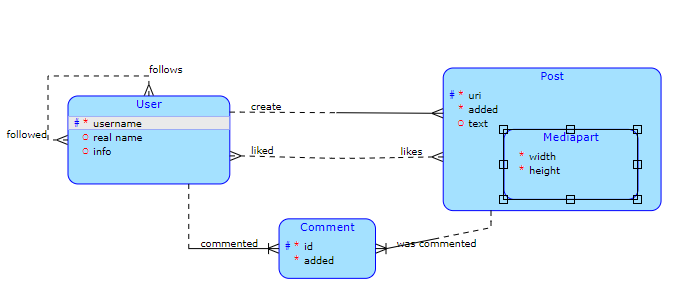

# Semestral work - Server (Social_network)

> Dotaz navíc: Zobrazení celkového počtu liků, co uživatel získal za Posty

> Koplexní operace: Spoluautorství. Uživatel vytvoří příspěvek a může nastavit dalšího uživatele jako autora, takže se
vytvoří post u dalšího uživatele.

## Model:

