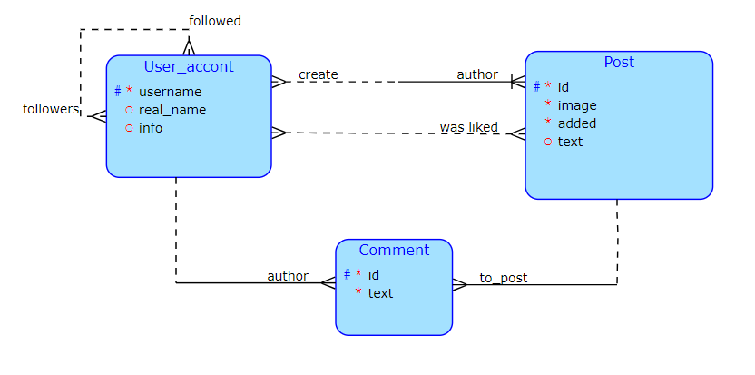
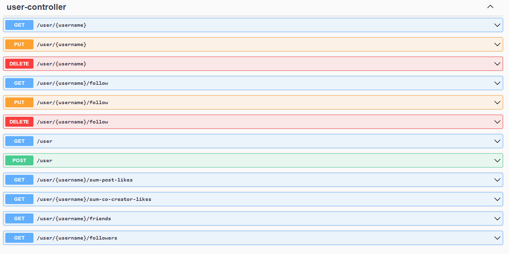
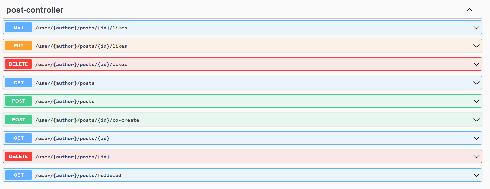
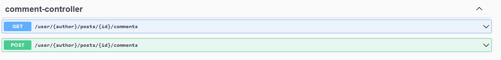
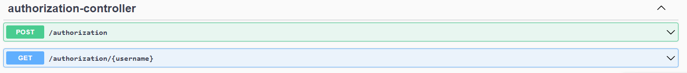

# Semestral work - Server (Social_network):

> Dotaz navíc: Pocitej vsechny like u prispevku kde se nastavil jako spoluautor. (V textu bude nastaven spoluauthor: username)

> Koplexní operace: Spoluautorství. Uživatel vytvoří příspěvek a může nastavit dalšího uživatele jako spoluautora, takže
> se vytvoří post i u dalšího uživatele s přidaným textem k příspěvku. Podmínka pro vytvoření spolu autora je, že se
> uživatelé sledují navzájem.



---

## Informace k serveru:

> Jedná se o server k sociální síti, s dockerem pro ukádaní dat, které se následně smažou protože databáze je v application.properties nastavená na create-drop.
> Je i zde udělané Authorizace ale pouze v rámci server-client, není to bezpečné, pro účely správného pracování aplikace to stačí
---

## REST API dokumentace

### Celková API dokumentace zde: http://localhost:8090/swagger-ui/index.html#/

### Rychlý přehled:









---
## Spuštění aplikace:
    
### Potřebné aplikace:

- API: https://gitlab.fit.cvut.cz/parizmat/social_network_server

- Client: https://gitlab.fit.cvut.cz/parizmat/social_network_client 

### Požadavky:

- JVM
- Gradle
- Docker

### Spuštení API:

```
    docker-compose up -d
    # nahrani dat do dockeru pro insert-script (kvůli obrázkům)
    docker cp ./src/main/resources/images/img1 social_network_server-postgres-1:/docker-entrypoint-initdb.d/
    docker cp ./src/main/resources/images/img2 social_network_server-postgres-1:/docker-entrypoint-initdb.d/
    docker cp ./src/main/resources/images/img3 social_network_server-postgres-1:/docker-entrypoint-initdb.d/
    docker cp ./src/main/resources/images/img4 social_network_server-postgres-1:/docker-entrypoint-initdb.d/
    docker cp ./src/main/resources/images/img5 social_network_server-postgres-1:/docker-entrypoint-initdb.d/
```

```
    ./gradlew bootRun
```

### Spuštění Client:

```
    ./gradlew bootRun
```
----
## Adresy:

- Server: http://localhost:8090/ 
- Client: http://localhost:9080/